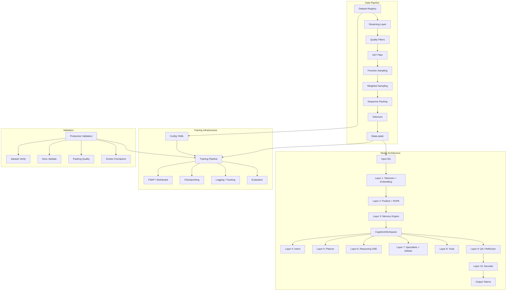

# 01 — Project Overview

## Project Purpose

This project is a hybrid machine learning research and training framework that combines four major capabilities into a single cohesive system. First, it provides a production-grade foundation model training pipeline spanning the entire data workflow — from dataset registry and streaming through quality filtering, AST-based code filtering, function sampling, weighted sampling, sequence packing, tokenization, and dataloader construction. Second, it implements two novel neural architectures: Dhara, an 11-layer workspace-centric reasoning model built on a structured state-space model (SSM) backbone, and NSLT (Neural State-Space Liquid Transformer), a non-transformer architecture with O(1) memory complexity through SSM compression, continuous-time ODE reasoning via Liquid Time-Constant (LTC) layers, and energy-based latent-space reasoning. Third, the project includes a complete alignment pipeline supporting Constitutional AI, Direct Preference Optimization (DPO), ORPO, SimPO, and KTO alignment methods. Fourth, it provides a custom Pydantic-based configuration system with cross-field validation and automatic v1-to-v2 migration, a benchmarking and evaluation suite, and production validation tooling.

The system targets training from scratch on consumer and workstation GPUs. It is designed to support both small-scale experimentation on a single GPU and full-scale distributed training across multiple A100 80GB GPUs.

## Research Goals

The primary research goals of this project are fourfold. The first goal is foundation pretraining of a roughly 160 million parameter model on a single NVIDIA A100 80GB GPU, using the config_foundation.yaml configuration with a reduced vocabulary of 64,000 tokens and scaled-down architecture dimensions. This serves as a proof point that the Dhara architecture can be trained from scratch with reasonable compute requirements.

The second goal is full-scale training with the Dhara architecture at approximately 7 billion parameters across 4x A100 80GB GPUs using FSDP full-shard with CPU offload, targeting 262 billion training tokens over 1 million steps with an effective batch size of 64. This explores the scaling properties of workspace-centric reasoning models beyond the transformer paradigm.

The third goal is to investigate workspace-centric O(1) memory architectures and compare their properties against standard transformers. Both Dhara and NSLT replace the quadratic-complexity attention mechanism with structured state-space sequence models that maintain a fixed-size compressed state regardless of sequence length. This eliminates the KV-cache scaling problem that limits transformer inference at long contexts. The project deliberately overtrain by approximately 130x beyond Chinchilla-optimal token counts to study how extended pretraining affects SSM-based models with fixed state capacity.

The fourth goal is to explore continuous-time ODE reasoning through LTC layers and latent-space energy-based reasoning through the LatentSandbox module. These mechanisms replace autoregressive chain-of-thought with parallel energy minimization in a compressed latent space, potentially offering more efficient reasoning trajectories.

## Overall Architecture

The system is organized into three major pipelines that work together to produce a trained, aligned model.

**Data Pipeline:** The data pipeline begins with the Dataset Registry, which contains 54 primary entries (58 registered including fallback-only entries) across 8 categories (code, web_text, docs, wiki, math, science, books, structured_knowledge) with category weights that sum to 1.0. Each registry entry includes fallback chains, quality scores, language tags, and domain classifications. The Streaming Layer handles both Dataset and IterableDataset types from HuggingFace Datasets, with automatic text field detection and gated dataset access handling. Quality Filters apply multi-component scoring including language confidence, formatting quality, code quality, doc completeness, perplexity estimation, and toxicity scoring. Deduplication can use exact hash matching, MinHash approximation, SimHash similarity, or embedding-based semantic deduplication. Contamination filters remove benchmark overlap. For code datasets, an AST Filter parses and validates syntax, rejects auto-generated code, and filters low-identifier-ratio samples. The Function Sampling module extracts individual functions from source files for datasets that support it. The Weighted Sampling and Sequence Packing modules pack variable-length sequences into fixed-length training examples with EOS separators and attention masks. The resulting dataset is consumed by the DataLoader.

**Training Pipeline:** The training pipeline is driven by configuration loaded through the Pydantic schema. The Model Factory creates the appropriate model based on the model_type field (dhara_v3, nslt, llama, mixtral, qwen2_moe, or deepseek_v2). Distributed setup configures FSDP, DeepSpeed, or DDP depending on the strategy. Gradient scaling and mixed precision (bf16, fp16, or fp32) are configured through the distributed config. Checkpointing happens every save_steps with save_total_limit retention and per-stage directory organization. Logging is provided by an ExperimentTracker that supports Weights and Biases, MLflow, and TensorBoard. The training loop includes logging and NaN-safe callbacks.

**Validation Pipeline:** The validation pipeline consists of eight automated phases. Phase 1 verifies the dataset registry by attempting to load samples from every registered dataset and reporting availability percentages. Phase 2 builds the documentation corpus by running 18 web scrapers. Phase 3 validates documentation quality by checking for missing files, duplicate URLs, short documents, and metadata completeness. Phase 4 validates token distribution against target category weights. Phase 5 decodes packed samples for human inspection. Phase 6 runs a smoke training test with a small number of steps. Phase 7 validates checkpoint saving and resumption. Phase 8 runs a comprehensive summary report.

## Current Implementation Status

| Component | Status | Notes |
|-----------|--------|-------|
| Data pipeline (foundation) | ✅ Production-ready | Registry, streaming, packing, quality, AST filtering |
| Doc builder | ✅ Production-ready | 18 scrapers, client-side redirect, timeout, fallback |
| Production validation | ✅ Production-ready | 8-phase automated validation |
| Dhara model | ✅ Implemented | 11 layers, PretrainedConfig, HF compatible |
| NSLT model | ✅ Implemented | SSM + LTC + Sandbox + Sparse Output |
| Training pipeline | ⚠️ Partially tested | Pretrain loop exists, SFT/Instruction stages scaffolded |
| Alignment pipeline | ⚠️ Scaffolded | DPO trainer, Constitutional AI |
| Distributed training | ⚠️ Scaffolded | FSDP/DeepSpeed/DDP configs exist |
| Evaluation | ⚠️ Partially implemented | Benchmarks scaffolded |
| Tests | ✅ 26 test files, 292 passing | Covers data pipeline, async hardening, health reporter, trainers, CLI, registry builds |
| Documentation | ✅ Good | README, ARCHITECTURE.md, PROJECT_DOCUMENTATION.md exist |

## Intended Users

This project is designed for AI and machine learning researchers who are exploring non-transformer architectures and want to experiment with SSM-based models, continuous-time ODE reasoning, and workspace-centric cognitive architectures. It is also intended for engineers who need a production-quality data pipeline for large-scale LLM training with registry-driven dataset management, quality scoring, deduplication, contamination filtering, and fallback chains. Finally, it targets teams that need an end-to-end framework spanning pretraining, supervised fine-tuning, instruction tuning, alignment, and evaluation in a single config-driven system.

## Design Philosophy

The project is guided by seven core design principles.

**Data quality first:** The system is registry-driven with 54 primary dataset entries (58 registered including fallback-only) across 8 categories. Each dataset has a quality score, category weight, domain tag, language tag, and fallback chain. The pipeline applies multi-component quality scoring with category-specific weights, three levels of deduplication, benchmark contamination removal, AST-based code validation, and boilerplate/license detection. All filtering decisions are logged with per-dataset rejection statistics.

**O(1) memory architectures:** Both Dhara and NSLT replace the quadratic self-attention mechanism with structured state-space models that maintain a fixed-size compressed state regardless of sequence length. This eliminates the KV-cache scaling problem that limits transformer inference at long contexts. The compressed state dimension is a configurable hyperparameter (d_state).

**Workspace-centric reasoning:** The CognitiveWorkspace serves as a unified communication hub for all modules in Dhara. Instead of modules calling each other directly, each module writes its output to the workspace, and subsequent modules read from it. This includes memory, intent, planning, reasoning, specialists, tools, and quality assurance modules. The workspace provides read, write, read_all, and clear operations.

**Symbolic and neural hybrid:** The InternalToolInterface replaces neural tool approximations with true symbolic execution. The calculator uses ast.parse with eval in a restricted namespace. Code execution uses exec in sandboxed locals. Web search and database queries use direct API calls. The router that decides which tool to use is learned, but the tool execution itself is symbolic.

**Energy-based latent reasoning:** The LatentSandbox module in NSLT replaces autoregressive chain-of-thought with parallel energy minimization. Multiple trajectory vectors are initialized and iteratively refined through energy descent in a compressed latent space. This allows the model to explore multiple reasoning paths simultaneously and select the lowest-energy trajectory.

**Production rigor:** Every component has validation, fallback, logging, and health reporting. The data pipeline tracks per-dataset rejection rates, quality score distributions, token length distributions, language distributions, and domain distributions. The production validation script runs 8 automated phases. The health reporter generates structured reports with summary statistics.

**Config-driven design:** All parameters are specified through YAML configuration files validated by Pydantic v2 models with cross-field validators. The schema includes automatic v1-to-v2 migration for backward compatibility. Three configuration files are provided: config.yaml (full ~7B parameter training), config_small.yaml (~173M parameters for single GPU), and config_foundation.yaml (~160M parameters optimized for a single A100 80GB).
