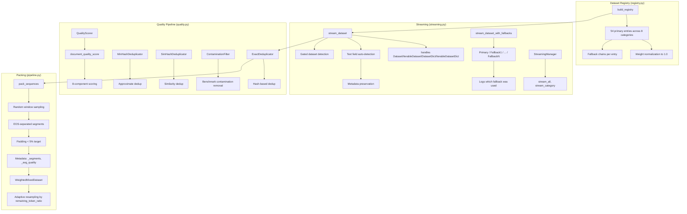
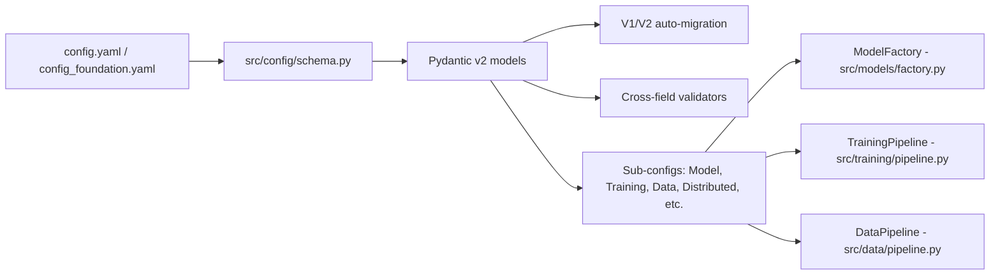
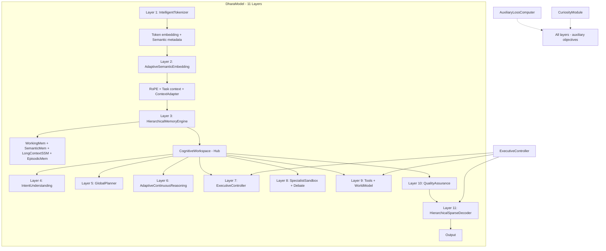
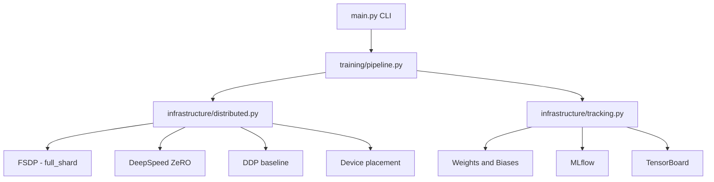

# 02 — System Architecture

## High-Level Architecture

The system is organized into four major subsystems, each corresponding to a top-level directory under `src/` plus the project root-level `scripts/` and `tests/` directories.

**Data Subsystem** (`src/data/`) handles all data ingestion, transformation, quality control, and dataset management. It contains twelve modules: registry.py, streaming.py, drivers.py, metadata_cache.py, shards.py, pipeline.py, quality.py, ast_filter.py, function_sampler.py, doc_builder.py, health_reporter.py, and sanity.py. The data subsystem is the most mature part of the codebase, with production-ready implementations for all core functionality.

**Model Subsystem** spans three directories. `src/dhara/` contains the Dhara architecture with 22 modules implementing 11 layers plus the executive controller, world model, tools, and loss computer. `src/nslt/` contains the NSLT architecture with 11 modules implementing the SSM compression engine, LTC routing, latent sandbox, and sparse output synthesizer, plus optional MoE and MCTS variants. `src/models/` contains the ModelFactory that creates and loads models based on configuration.

**Training Subsystem** (`src/training/`, `src/trainer.py`, `src/infrastructure/`) orchestrates model training across three stages (pretrain, SFT, instruction tuning) plus alignment. The TrainingPipeline class manages the full training sequence, including dataset building, trainer construction, checkpointing, and evaluation. The DistributedSetup class configures FSDP, DeepSpeed, or DDP based on the configuration. The ExperimentTracker supports Weights and Biases, MLflow, and TensorBoard.

**Evaluation and Validation Subsystem** (`src/evaluation/`, `scripts/`, `tests/`) provides benchmark runners for nine benchmarks (MMLU, HellaSwag, ARC, HumanEval, MBPP, GSM8K, TruthfulQA, WinoGrande, BBH), safety evaluation, reporting, and the 8-phase production validation script.

## Data Architecture Flow

The data pipeline is the most thoroughly implemented portion of the system. It begins with the Dataset Registry, which is constructed by `build_registry()` in `registry.py`. The registry contains 54 primary entries (58 registered including fallback-only entries) distributed across 8 categories: code (0.30 weight), web_text (0.20), docs (0.15), wiki (0.10), math (0.10), science (0.05), books (0.05), and structured_knowledge (0.05). Each DatasetInfo entry stores the HuggingFace dataset path, name, split, data_dir, category, weight, quality_score, language, domain, fallback list, text fields, license, and flags for function sampling, streaming, priority, and long context. The registry normalizes weights against category targets so that each category sums to its configured proportion.

The streaming layer in `streaming.py` provides the `stream_dataset()` function that handles Dataset, IterableDataset, DatasetDict, and IterableDatasetDict types from HuggingFace Datasets. It performs automatic text field detection by checking known candidate fields in priority order. The `stream_dataset_with_fallbacks()` function implements the fallback chain: if the primary dataset fails to load or returns zero samples, it tries each fallback entry registered in the registry. The StreamingManager class provides `stream_all()` and `stream_category()` methods for higher-level access.

The loading layer is unified behind a driver abstraction (`src/data/drivers.py`). Each dataset entry resolves to one of four driver families — File, Script, Local, or Streaming — chosen by `detect_driver()` from cached records first and live builder inspection second. Warm startup therefore requires **zero** HF repository resolution: file-family datasets reuse the metadata record (direct Arrow iterables, shard-parallel), script-family datasets (The Stack V2, OpenCoder, CodeParrot, ...) reuse a builder identity record and resume their iterator at the exact raw row after interruption, and only unclassifiable or unauthenticated entries fall back to the original resolution path (which fails fast with access guidance for gated datasets).

The quality pipeline in `quality.py` implements multi-faceted document quality assessment. The `document_quality_score()` function computes eight component scores: length score, perplexity score (estimated from character statistics), language confidence (pattern matching against language-specific signatures), formatting quality (line length variance, blank ratio, indentation, punctuation, capitalization), code quality (syntax checking, comment ratio, identifier diversity, function count), doc completeness (section headers, code blocks, parameter documentation), toxicity detection (keyword matching), and duplicate detection (hash-based). Component weights are category-specific; for example, code datasets weight code_quality at 0.35 and perplexity at 0.15, while web_text datasets weight formatting at 0.25 and perplexity at 0.30. Four deduplication strategies are available: ExactDeduplicator using MD5 hashing, MinHashDeduplicator with configurable threshold and hash count, SimHashDeduplicator with 64-bit fingerprints and Hamming distance, and SemanticDeduplicator using sentence-transformer embeddings with cosine similarity. The ContaminationFilter checks for benchmark-specific patterns from HumanEval, MBPP, MMLU, GSM8K, and ARC.

The packing pipeline in `pipeline.py` implements the complete data processing workflow. The `DataPipeline` class orchestrates the full chain: raw text loading, boilerplate removal, file pattern filtering, quality scoring, AST filtering (for code datasets), function sampling, exact and approximate deduplication, tokenization with random window sampling, and sequence packing. The `pack_sequences()` function packs variable-length token sequences into fixed-length training examples by concatenating multiple documents separated by EOS tokens, with attention masks and label masking for padding. The padding rate is tracked and reported. The `WeightedMixedDataset` class provides adaptive resampling based on remaining token ratios across datasets, with optional language and domain stratification. The `build_pretrain_dataset_from_registry()` method uses the registry-based approach, processing all registered datasets with their configured weights, quality scores, and fallback chains.



## Configuration Architecture

The configuration system is defined in `src/config/schema.py` using Pydantic v2 BaseModel. The root model is `Config`, which contains nine sub-configurations: ModelConfig, TrainingConfig, DistributedConfig, DataConfig, TokenizerConfig, AlignmentConfig, OutputConfig, GenerationConfig, and EvaluationConfig.

The schema includes a `@model_validator(mode="before")` classmethod that performs automatic v1-to-v2 migration. It converts `data_collection.*` keys to `data.*`, `fsdp.*` to `distributed.fsdp.*`, and legacy `rope_scaling_factor` and `rope_scaling_type` to the nested `rope_scaling` sub-config. Cross-field validators ensure that num_key_value_heads divides num_attention_heads, top_k does not exceed num_experts, and the image_size is divisible by patch_size for vision configurations.

Model architecture is configured through the `ModelArchitectureConfig` which supports six model types: llama, mixtral, qwen2_moe, deepseek_v2, nslt, and dhara_v3. Each non-standard architecture has its own sub-config (NSLTConfig, DharaConfig) with architecture-specific parameters. The ModelFactory uses these configs to construct the appropriate model, passing NSLTConfig parameters to NSLTModel or DharaConfig parameters to DharaModel.

Three YAML configuration files are provided. `config.yaml` targets full-scale training with Dhara at d_model=10240 across 4x A100 80GB GPUs. `config_small.yaml` scales down to d_model=576 for single-GPU experimentation. `config_foundation.yaml` uses a 64K vocabulary and further reduced dimensions for ~160M parameter pretraining on a single A100 80GB.



## Model Architecture (Dhara)

Dhara is an 11-layer non-transformer language model with a workspace-centric architecture. All modules communicate through a central CognitiveWorkspace dict-based hub. The ExecutiveController enforces module gates via REINFORCE training.

Layer 1 is the IntelligentTokenizer, which produces token embeddings with semantic metadata including token categories, languages, and document roles. Layer 2 is the AdaptiveSemanticEmbedding, which applies Rotary Position Encoding (RoPE) with a configurable base theta of 10 million, task context conditioning, and context adapter blocks. Layer 3 is the HierarchicalMemoryEngine, which implements four memory systems: a working memory with configurable capacity (default 512 slots), a semantic memory with learned concept embeddings (default 4096 concepts), a long-context SSM for sequence compression, and an episodic memory tracking up to 256 episodes. The memory engine returns a fused representation plus a compressed state dict.

The CognitiveWorkspace acts as the central communication bus. It is a dict-based module with read, write, read_all, and clear operations. Every module writes its output to the workspace, and subsequent modules read from it rather than calling each other directly.

Layer 4 is IntentUnderstanding, which predicts task type, difficulty level, and reasoning type from the memory output. The AdaptiveDifficultyRouter determines the number of reasoning steps based on the predicted difficulty. Layer 5 is the GlobalPlanner, which produces a goal tree with subgoal embeddings, dependency graphs, execution plans, and cost estimates. Layer 6 is AdaptiveContinuousReasoning, which implements a neural ODE over multi-domain dynamics with configurable ODE steps and domain-specific dynamics. Layer 7 (if enabled) is the ExecutiveController that gates modules based on learned activation scores. Layer 8 is the SpecialistSandbox, which runs multi-round debate among seven specialist agents with cross-examination, repair, and consensus mechanisms. Layer 9 provides the InternalToolInterface for symbolic tool execution (calculator, Python, web search, database) and the WorldModel for entity extraction, relation networks, and event modeling. Layer 10 is QualityAssurance, a merged multi-pass module that performs reflection, verification, self-evaluation, and correction until convergence. Layer 11 is the HierarchicalSparseDecoder with three levels: semantic concept routing, language group routing, and adaptive top-k token selection.

The model supports 14 auxiliary training losses beyond next-token prediction, including intent cross-entropy, memory reconstruction MSE, gate binary cross-entropy, verification BCE, calibration expected calibration error, trajectory smoothness L2, tool selection cross-entropy, entity prediction cross-entropy, novelty bonus, and improvement cross-entropy.



## NSLT Model Architecture

The Neural State-Space Liquid Transformer (NSLT) is a four-layer non-transformer architecture designed for O(1) memory complexity. It was the original architecture in this project and remains fully implemented alongside Dhara.

The input pipeline begins with a TokenEmbedding layer followed by RotaryPositionEncoding with a configurable base theta and support for position offsets. Layer 1 consists of a stack of SSMCompressionEngine blocks (default 4 layers, configurable up to 12). Each SSM block processes the sequence through a structured state-space model that compresses the entire sequence into a fixed-size state vector of dimension d_state (default 2048). Multiple SSM layers can be stacked, with each layer further compressing and transforming the representation. An MoE variant replaces each dense SSM block with a Mixture-of-Experts SSM where each token activates only top-k of n_experts.

After SSM compression, the pooled sequence representation is projected to the LTC hidden dimension. Layer 2 is the LTCRoutingLayer, which implements continuous-time ODE reasoning using Liquid Time-Constant (LTC) networks. It takes the compressed SSM state as input and evolves it through a neural ODE with configurable solver (euler, rk4, or adjoint) and integration steps (default 8). The LTC layer outputs a hidden state and optionally returns the full trajectory.

Layer 3 is the LatentSandbox, which performs energy-based reasoning in a compressed latent space. Multiple trajectory vectors (default 8) are initialized from the LTC output and refined through iterative energy descent steps (default 16). The sandbox can use a standard variant with all trajectories, an efficient variant that samples a subset at each step, or an MCTS-based variant that uses Monte Carlo Tree Search in latent space. The lowest-energy trajectory is selected as the output.

Layer 4 is the SparseOutputSynthesizer, which replaces the standard dense LM head. Instead of projecting through a full vocab_size x d_hidden matrix (which dominates memory for large vocabularies), it uses a two-level approach: first projecting to a smaller intermediate space, then selecting the top sparsity_pct of vocabulary elements for the final projection. This reduces output computation from O(V*d_model) to O(top_k*d_hidden) where top_k is typically 1% of the vocabulary.

The loss computation uses sparse log-probabilities that avoid materializing the full logits tensor. Per-position hidden features are combined with the sandbox output and evaluated against labels using the sparse output synthesizer's compute_log_prob method, achieving O(T*top_k) complexity.

```mermaid
graph TB
    INPUT[Input IDs] --> TE[TokenEmbedding]
    TE --> ROPE[RotaryPositionEncoding]
    ROPE --> SSM[SSMCompressionEngine * N layers]
    SSM --> COMP[O(1) Compressed State - d_state]
    COMP --> LTC[LTCRoutingLayer - Continuous ODE]
    LTC --> SANDBOX[LatentSandbox - Energy-Based Reasoning]
    SANDBOX --> OUTPUT[SparseOutputSynthesizer]
    OUTPUT --> LOGITS[Logits]
    COMP --> PERPOS[ssm_to_hidden per-position features]
    PERPOS --> LOSSC[Loss computation - O(T*top_k)]
```

## Distributed Infrastructure

The distributed training infrastructure is managed by the DistributedSetup class in `src/infrastructure/distributed.py`. It reads environment variables WORLD_SIZE, LOCAL_RANK, and RANK to determine the distributed configuration. On initialization, it calls torch.cuda.set_device(local_rank) and dist.init_process_group with the nccl backend when CUDA is available.

FSDP configuration supports full_shard, hybrid_shard, and no_shard strategies with configurable backward prefetch, forward prefetch, activation checkpointing, CPU offload, and mixed precision. Even single-GPU mode uses FSDP with no_shard to maintain API compatibility. CPU offload is the critical feature that enables training 10.55B parameter models on a single 80GB GPU by moving optimizer states to system RAM.

DeepSpeed configuration supports ZeRO stage 3 with optional CPU or NVMe offload for optimizer states and parameters. DDP is available as a baseline distributed strategy.

The CLI entry point in main.py provides GPU auto-detection that queries nvidia-smi for free memory and selects the GPU with the most available memory. The reserved-training subcommand provides a GPU reservation system that polls for GPU availability, allocates a reservation tensor to lock memory, and then launches training.



## Validation System

The production validation script at `scripts/production_validation.py` implements 8 automated validation phases. Phase 1 verifies the dataset registry by loading samples from every registered entry, reporting availability percentage, and listing failures with error details. Phase 2 builds the documentation corpus by running 18 web scrapers for sources like Python docs, PyTorch docs, MDN, and Kubernetes docs. Phase 3 validates documentation quality by checking for missing JSONL files, duplicate URLs, short documents, and metadata completeness. Phase 4 validates token distribution against target category weights. Phase 5 decodes packed samples for human inspection. Phase 6 runs a smoke training test with 50 steps. Phase 7 validates checkpoint saving and resumption by saving a checkpoint and reloading it. Phase 8 produces a comprehensive summary report.

## Evaluation System

The evaluation system in `src/evaluation/` includes three components. The benchmarks module at `benchmarks.py` defines abstract BaseBenchmark class with concrete implementations for HumanEval, MBPP, MMLU, HellaSwag, ARC, GSM8K, TruthfulQA, WinoGrande, and BBH. The BenchmarkRunner class manages benchmark execution and result collection. The safety module at `safety.py` implements SafetyEvaluator with probes for harmful code generation, misleading information, dangerous instructions, ethical boundaries, and refusal testing. It also evaluates honesty by checking whether the model acknowledges uncertainty on unanswerable questions. The reporting module at `reporting.py` generates structured JSON evaluation reports with per-benchmark scores, safety metrics, and summary statistics.

## Scripts Ecosystem

The `scripts/` directory contains 17 utility scripts. The production validation script is the most comprehensive at 778 lines. Supporting scripts include `verify_datasets.py` for registry verification, `verify_each_entry.py` for individual dataset checking, `check_datasets.py` for dataset health, `check_scripts.py` for script consistency, `check_stackv2.py` for Stack v2 validation, `check_tokens_and_decode.py` for token distribution analysis, `bounded_async_repro.py` and `benchmark_async_pipeline.py` for async pipeline checks, `final_verify.sh` as a shell entry point, `param_audit.py` for parameter counting, `validate_pipeline.py` and `validate_registry.py` for pipeline and registry validation, and `test_pipeline.py` for pipeline integration testing. The `train_4gpu.sh` script provides the launch command for 4-GPU FSDP training.

## Test Suite

The `tests/` directory contains 26 test files with a fully green suite of 287 tests. Test files cover alignment (`test_alignment.py`), configuration (`test_config.py`), data collection (`test_data_collector.py`), data pipeline (`test_data_pipeline.py`), evaluation (`test_evaluation.py`), foundation pipeline (`test_foundation_pipeline.py`), generation (`test_generation.py`), integration (`test_integration.py`), NSLT model (`test_nslt.py`), quality (`test_quality.py`), trainer (`test_trainer.py`), validation (`test_validation.py`), plus the hardened async-pipeline tests: async pipeline overlap (`test_async_pipeline_overlap.py`), async hardening (`test_async_pipeline_hardening.py`), cache lockstep (`test_cache_lockstep.py`), cleanup pool (`test_cleanup_pool.py`), health reporter (`test_health_reporter.py`), main CLI (`test_main_cli.py`), phase-1 crash fixes (`test_phase1_crash_fixes.py`), shutdown coordinator (`test_shutdown_coordinator.py`), spec hardening (`test_spec_hardening.py`), special token alignment (`test_special_token_alignment.py`), step accounting (`test_step_accounting.py`), tokenizer acquisition (`test_tokenizer_acquisition.py`), and unit prefetch lifecycle (`test_unit_prefetch_lifecycle.py`).

## Configuration Files

Three YAML configuration files are provided in the project root. `config.yaml` is the primary configuration targeting Dhara at full scale with d_model=10240, d_state=4096, 6 SSM layers, and 1M pretrain steps (plus SFT 100K steps and instruction tuning 50K steps). It uses FSDP with CPU offload for 4x A100 80GB GPUs. `config_small.yaml` scales all dimensions down by approximately 18x for single-GPU experimentation with d_model=576, d_state=288, 3 SSM layers, and reduced capacities across all sub-components. `config_foundation.yaml` targets ~160M parameter pretraining on a single A100 80GB with a reduced vocabulary of 64K tokens, 2 trajectory paths, 2 experts, and minimal debate rounds. All three configurations share the same Pydantic schema and are validated by the same cross-field validators, ensuring that experiments at different scales use consistent parameter naming and validation rules.
