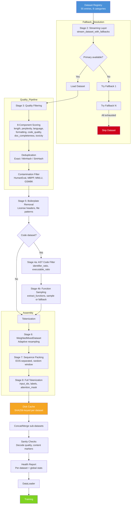

# Data Pipeline Documentation

The data pipeline is the most mature and thoroughly tested subsystem in this codebase. It processes raw datasets from the HuggingFace Hub through 8 sequential stages to produce tokenized, packed training samples ready for model training. The pipeline supports pretraining, SFT, and preference optimization with configurable quality gates at every stage.

---

## Overview

```
Raw Datasets (55 entries, 8 categories)
  │
  ▼
Stage 1: Registry ──────── build_registry() creates 55 entries
  │
  ▼
Stage 2: Streaming ──────── stream_dataset_with_fallbacks(), 4 Dataset types
  │
  ▼
Stage 3: Quality Filtering ─ document_quality_score(), 8-component analysis
  │
  ▼
Stage 4: Code Processing ─── AST filter + function sampling
  │
  ▼
Stage 5: Boilerplate Removal ─ license header stripping, file pattern skip
  │
  ▼
Stage 6: Weighted Sampling ── WeightedMixedDataset, adaptive resampling
  │
  ▼
Stage 7: Sequence Packing ─── EOS-separated, random window, metadata
  │
  ▼
Stage 8: Tokenization ──────── transformers tokenizer, vocab_size=64K/128K
  │
  ▼
Disk Cache ────────────────── SHA256-keyed, stage-specific, save_to_disk
  │
  ▼
DataLoader → Training
```

---

## Stage 1: Registry (`registry.py`)

**Entry point**: `build_registry()` → `DatasetRegistry` with 55 entries across 8 categories.

### Category Structure

| Category | Weight | # Entries | Primary Sources |
|---|---|---|---|
| `code` | 0.30 | 25+ | OPC FineWeb Code, Stack v2, CodeSearchNet, CodeParrot, CodeContests |
| `web_text` | 0.20 | 2+ | FineWeb, fallbacks: Dolma, RedPajama, Falcon RefinedWeb |
| `docs` | 0.15 | 18+ | FineWeb-Edu + 18 scraped documentation sources |
| `wiki` | 0.10 | 1 | Wikimedia Wikipedia (20231101.en) |
| `math` | 0.10 | 6 | OpenWebMath, NuminaMath-CoT, NuminaMath-1.5, MathPile, FineWeb-Edu (proxy), LeanDojo |
| `science` | 0.05 | 1+ | FineWeb-Edu (science proxy) |
| `books` | 0.05 | 3+ | FineWeb-Edu (books proxy), FineWeb (books proxy) |
| `structured_knowledge` | 0.05 | 2+ | FineWeb-Edu, FineWeb |

### Entry Metadata

Every `DatasetInfo` carries:
- **Path/name/split**: HuggingFace dataset coordinates
- **Category/weight**: Category assignment and base sampling weight
- **Quality score**: Static quality estimate (0.84–0.99)
- **Fallbacks**: Ordered list of backup dataset paths
- **Text fields**: Candidate field names for text extraction
- **Language/domain**: Programming language and functional domain
- **Function sampling flag**: Whether to apply function-level extraction
- **Priority**: Loading order priority

### Weight Normalization

`normalize_weights(category_targets)` scales per-entry weights so each category sums to its `CATEGORY_WEIGHTS` target. Floating-point drift is corrected by adjusting the last entry. The total weight after normalization always equals 1.0.

### Fallback Chain Examples

- `opc-fineweb-code-corpus` → `code-search-net/code_search_net` → `codeparrot/codeparrot-clean`
- `open-web-math/open-web-math` → (no fallback)
- `AI-MO/NuminaMath-CoT` → `AI-MO/NuminaMath-1.5` (bidirectional)
- `HuggingFaceFW/fineweb` → `allenai/dolma` → `togethercomputer/RedPajama-Data-1T` → `tiiuae/falcon-refinedweb`
- All doc scraper entries → `HuggingFaceFW/fineweb-edu`
- `python-docs` (json path) → `HuggingFaceFW/fineweb-edu`

---

## Stage 2: Streaming (`streaming.py` + `drivers.py`)

**Entry point**: `stream_dataset_with_fallbacks(info, registry, limit)` → `Generator[dict]`

### Driver Families

Before any network or builder resolution, `detect_driver()` (`src/data/drivers.py`)
classifies each entry into one of four families:

| Family | Detected when | Behavior |
|---|---|---|
| `LocalDatasetDriver` | Path is an existing local directory with recognized files | Never touches the Hub; scans and loads locally |
| `FileDatasetDriver` | Metadata record verifies (cached file list) | Direct Arrow iterable reuse, shard-parallel streaming, no HF resolution |
| `ScriptDatasetDriver` | Builder record verifies, or builder exposes no shard sources | Streams via `load_dataset_builder()` + iterator resume at exact raw row after interruption |
| `StreamingDatasetDriver` | Builder inspection fails (gated / not-found / offline) | Original resolution cold path; logs access guidance once and short-circuits instead of retrying |

Detection requires **zero** network calls on a fully warm run. The next two
entries' drivers are warmed in the background while the current one streams.
Each entry logs `[DIAG] <family> driver: (hits)` with metadata/builder hit
flags, resolution-skipped status, and iterator-resumed status.

### Dataset Type Handling

`stream_dataset()` handles all 4 return types from `datasets.load_dataset()`:

| Return Type | Handling |
|---|---|
| `Dataset` | Iterate directly |
| `IterableDataset` | Iterate directly (streaming mode) |
| `DatasetDict` | Extract `ds[split]` key |
| `IterableDatasetDict` | Extract `ds[split]` key |

### Text Field Detection

`detect_text_fields(sample, known_fields)` scans the first sample for text fields:
1. Check known_fields (from DatasetInfo.text_fields)
2. Check TEXT_FIELD_PRIORITY list: text, content, body, code, document, etc.
3. Fall back to any string field > 50 chars
4. Ultimate fallback: `["text"]`

### Gated Dataset Detection

When `load_dataset()` raises an exception, `_is_gated_error()` checks for keywords: "gated", "access", "permission", "401", "403". If detected, the system checks for `HF_TOKEN` env var and shows user-friendly access instructions.

### Sample Output Format

Every yielded sample is `{**original_sample, "text": extracted_text}`. All original fields are preserved alongside the extracted text field. This allows downstream stages to access metadata like file paths, language labels, and quality scores.

### Fallback Chain Resolution

`stream_dataset_with_fallbacks()` builds a chain: `[primary_info] + [registry.lookup(fb) for fb in primary.fallbacks]`. It tries each entry in order, skipping already-tried paths. On first non-zero sample count, it logs the fallback via `registry.log_fallback()` and returns. If all entries return 0 samples, an error is logged and None is yielded.

---

## Stage 3: Quality Filtering (`quality.py` + `pipeline.py`)

**Entry point**: `document_quality_score(text, category, language)` → `{"final": float, ...components}`

### 8-Component Quality Scoring

| Component | Scoring Logic | Range |
|---|---|---|
| `length` | `min(1.0, len(text) / 50000)` | 0.0–1.0 |
| `perplexity` | Word length avg, variance, vocabulary variety → estimated perplexity, then `1.0 - ppl/200` | 0.0–1.0 |
| `language_conf` | Regex signature matching for 13 languages, hit ratio | 0.0–1.0 |
| `formatting` | Line length, variance, blank ratio, indent, unique lines, punctuation, capitalization | -0.5–1.0 |
| `code_quality` | Python compilation test, type hints, tests, identifier diversity, comments, function count | -0.5–1.0 |
| `doc_completeness` | Section headers, code blocks, URLs, markdown links, word count | 0.0–1.0 |
| `toxicity` | Toxic word match ratio (`1.0 - hits * 0.25`) | 0.0–1.0 |
| `exact_duplicate` | MD5 hash of first 500 chars | 0.0 or 1.0 |

### Category-Specfic Weight Maps

Each category uses different component weights for the final score:

| Category | Primary Components |
|---|---|
| `code` | code_quality (0.35), language_conf (0.15), formatting (0.15), perplexity (0.15) |
| `docs`/`wiki` | doc_completeness (0.35), formatting (0.20), perplexity (0.15) |
| `math`/`science` | perplexity (0.35–0.40), formatting (0.15), doc_completeness (0.15–0.20) |
| `web_text` | perplexity (0.30), formatting (0.25), language_conf (0.20) |
| `books` | perplexity (0.40), formatting (0.20), language_conf (0.15) |

### Quality Thresholds

Per-category minimum quality thresholds in `QUALITY_THRESHOLDS`:
- code: 0.35, math: 0.30, science: 0.30
- web_text: 0.35, books: 0.40, docs: 0.35
- wiki: 0.35, structured_knowledge: 0.30

### Deduplication (3 Strategies)

| Strategy | Method | Use |
|---|---|---|
| **Exact** | MD5 hash of first 1000 chars, whitespace-normalized | Global first-pass in pipeline |
| **MinHash** | 128-permutation minhash, 5-gram shingles, Jaccard ≥ 0.85 | Config-based dedup |
| **SimHash** | 64-bit fingerprint, token-level feature vector, cosine ≥ 0.85 | Config-based dedup |
| **Semantic** | sentence-transformers embeddings (all-MiniLM-L6-v2), cosine ≥ 0.92 | Heavy semantic dedup |

### Contamination Filter

`ContaminationFilter` checks for benchmark-specific patterns:

| Benchmark | Patterns |
|---|---|
| HumanEval | `def check*`, `def test_`, `assert.*==` |
| MBPP | `""" >>>`, `def check*` |
| MMLU | `Answer: [A-D]`, `Question N:`, `(A) ` |
| GSM8K | `#### number`, `Let's think step by step`, `<<...>>` |
| ARC | `grid = [[`, `A. [`, `output_grid` |

---

## Stage 4: Code-Specific Processing (`ast_filter.py` + `function_sampler.py`)

**Entry point**: `filter_code(text, language, ast_filter_cfg)` → `(ok: bool, reason: str)`

### AST-Based Code Filtering

Only applied to `code` category datasets. Three metrics:

1. **`identifier_ratio(code)`** → `float`: Ratio of valid Python/JS identifiers to total tokens. Low ratio suggests non-code content or heavy boilerplate.
2. **`executable_ratio(code)`** → `float`: For Python, attempts `ast.parse()` on sliding windows. Measures fraction of syntactically valid code.
3. **`filter_code(code, language, cfg)`** → `(bool, str)`: Combined filtering:
   - Rejects autogenerated code (patterns: "auto-generated", "do not edit", "generated by")
   - Rejects one-liners (>95% of lines are single token)
   - Rejects low-identifier content (<5% identifiers)
   - Rejects low-executable content (<10% syntactically valid)

### Function-Level Sampling

Only applied to code datasets with `function_sampling=True` (Stack v2, CodeSearchNet, CodeParrot).

`extract_functions(code, language)` → `List[str]`: Regex-based function extraction:
- Python: `def name(args):` → extract body by indentation
- JavaScript/TypeScript: `function name(args)` → extract body by braces
- Rust: `fn name(args)` → extract body by braces
- Other: heuristic indentation-based extraction

`sample_functions_or_fallback(code, language, cfg)` → `str`:
- Extract up to `per_file_limit` functions
- Filter by `min_body_lines`/`max_body_lines`
- If no functions survive, return original code (fallback)
- If function extraction fails, return original code

`is_code_empty_or_trivial(code)` → `bool`: Filters out empty, whitespace-only, or single-line trivial code.

---

## Stage 5: Boilerplate Removal (`pipeline.py`)

**Entry point**: `remove_boilerplate(text, keywords)` → `str`

### License Header Detection

Scans the first 50 lines for license keywords:
```
copyright, license, spdx, apache, mit license, licensed under,
all rights reserved, gnu general public, bsd license, mozilla public,
permission is hereby granted, this file is part of,
generated by, auto-generated, do not edit, this code was generated
```

### File Pattern Skipping

`should_skip_file(file_path, patterns)` checks against `BOILERPLATE_FILE_PATTERNS`:
```
_pb2.py, _pb2_grpc.py, generated/, build/, dist/, vendor/,
node_modules/, .git/, __pycache__/,
.min.js, .min.css, .bundle.js,
package-lock.json, yarn.lock, go.sum, poetry.lock,
.tfstate, .parquet, .arrow, .o, .obj, .exe, .dll, .so
```

### Text Cleaning

After license removal:
- Collapse 4+ consecutive newlines to 2
- Strip trailing whitespace per line
- Final `.strip()` on entire text

---

## Stage 6: Weighted Sampling (`pipeline.py` — `WeightedMixedDataset`)

**Entry point**: `WeightedMixedDataset(datasets_with_weights, total_samples, ...)`

### Adaptive Resampling

The effective weight for each sub-dataset is:

```
effective_weight = base_weight × quality_score × remaining_token_ratio
```

Where `remaining_token_ratio = max(0, size - consumed) / max(size, 1)`.

Weights are renormalized every sample (via `_effective_weights()`), ensuring the sampler dynamically shifts toward under-consumed datasets.

### Stratification Options

1. **Language stratification**: Target distribution across 10 programming languages (python 0.35, javascript 0.12, typescript 0.08, etc.)
2. **Domain stratification**: Target distribution across 22 functional domains (backend, frontend, ml, cv, nlp, etc.)
3. **None**: Pure weighted random sampling

### Reproducibility

- Uses `numpy.random.default_rng(seed=rng_seed)` for deterministic sampling
- `rng_seed` comes from config (`project.seed`, default 42)

### Consumption Tracking

Each sub-dataset tracks how many times it has been sampled. The `stats()` method reports:
- Total samples per dataset
- Per-dataset weights
- Consumed counts
- Remaining ratios

---

## Stage 7: Sequence Packing (`pipeline.py` — `pack_sequences`)

**Entry point**: `pack_sequences(tokenized_samples, max_seq_length, eos_token_id)` → `(packed, packing_eff)`

### Packing Algorithm

```
For each tokenized sample:
  1. If sample > max_seq_length: random_window_sample() to max_seq_length
  2. If current buffer has room (including EOS separator): append with EOS
  3. If no room: pad to max_seq_length, emit packed sequence, start new buffer
After all samples: emit final buffer (with padding)
```

### EOS Separation

When a new segment is added to a partially-filled buffer, an EOS token is inserted between segments. The corresponding label for the EOS token is set to `-100` (ignored in loss computation).

### Random Window Sampling

Documents exceeding `max_seq_length` are not truncated at the start. Instead, a random contiguous window of length `max_seq_length` is extracted:

```python
start = random.randint(0, len(tokens) - max_seq_length)
tokens = tokens[start:start + max_seq_length]
```

### Per-Sequence Metadata

Each packed sequence includes:
- **`input_ids`**: Concatenated token IDs with EOS separators
- **`labels`**: Same as input_ids, with padding and EOS set to -100
- **`attention_mask`**: 1 for real tokens, 0 for padding
- **`_segments`**: Number of documents packed into this sequence
- **`_avg_quality`**: Mean quality score across packed segments

### Packing Efficiency

Reported as `packing_eff = 1.0 - (padded_tokens / total_slots)`. Target: <5% padding.

---

## Stage 8: Tokenization

**Entry point**: HuggingFace `PreTrainedTokenizerBase` (via transformers)

### Tokenizer Configuration

| Config | vocab_size | max_seq_length | Notes |
|---|---|---|---|
| `config_foundation.yaml` | 64000 | 2048 | Foundation pretraining |
| `config.yaml` | 128000 | 4096 | Full training (4x A100) |
| `config_small.yaml` | 128000 | 2048 | Single GPU debug |

### Tokenizer Model

- Source: `Xenova/claude-tokenizer` (HuggingFace)
- Type: BPE (Byte-Pair Encoding)
- Special tokens: `<s>`, `<pad>`, `</s>`, `<unk>`, `<mask>`, instruction markers
- Fields produced: `input_ids`, `labels`, `attention_mask`, `_segments`, `_avg_quality`

### Training Mode Fields

- Pretraining: `input_ids` = `labels` (causal LM)
- SFT: `labels` has prompt portion masked with `-100`
- Preference: `chosen_*` and `rejected_*` field pairs

---

## Cache Layer

**Entry point**: `_cached_dataset_path(ds_info, stage_name)` → `Path`

### Cache Key Generation

```python
raw = f"{path}_{max_samples}_{max_seq_length}_{vocab_size}_v3_foundation"
key = hashlib.sha256(raw.encode()).hexdigest()[:16]
```

### Cache Storage

`{cache_dir}/tokenized/{stage_name}/{sha256_prefix}/`

- Cache uses `datasets.Dataset.save_to_disk()` / `load_from_disk()`
- Each dataset is cached independently after tokenization and packing
- Cache is invalidated when config changes (max_seq_length, vocab_size, max_samples)
- Subsequent runs load from cache instead of re-streaming

---

## Pipeline Flow (Registry Mode)

When `cfg.data.use_registry` is `True`:

1. `build_registry()` creates all 55 entries
2. For each entry, `detect_driver()` picks the File/Script/Local/Streaming family, then `stream_dataset_with_fallbacks()` loads samples (warm runs skip HF resolution entirely; script-family datasets resume their iterator)
3. Samples pass through the filter pipeline:
   - Boilerplate removal → text length check → quality scoring
   - AST code filter → exact dedup → simhash dedup → function sampling
4. Cleaned texts are tokenized via `tokenizer(text)["input_ids"]`
5. Tokenized samples are packed via `pack_sequences()`
6. Packed sequences are cached to disk
7. All sub-datasets are combined into a `WeightedMixedDataset` with adaptive sampling
8. Sanity checks run on the final dataset
9. Health report is generated with per-dataset and global statistics

---

## Mermaid Diagram



---

## Configuration Reference

Key config sections controlling the pipeline:

### `data.quality.*`

| Path | Default | Description |
|---|---|---|
| `min_length` | 30 | Minimum document length (chars) |
| `max_length` | 500000 | Maximum document length (chars) |
| `deduplication.enabled` | true | Enable deduplication |
| `deduplication.method` | minhash | exact, minhash, or simhash |
| `deduplication.threshold` | 0.85 | Similarity threshold |
| `contamination.enabled` | true | Enable contamination filtering |
| `contamination.benchmarks` | [7 benchmarks] | Benchmarks to filter against |

### `data.preprocessing.*`

| Path | Default | Description |
|---|---|---|
| `remove_boilerplate` | true | Strip license headers |
| `min_text_length` | 100 | Minimum text length after boilerplate removal |
| `collapse_blank_lines` | true | Collapse 4+ newlines to 2 |
| `license_keywords` | [20 patterns] | Keywords triggering license header detection |
| `boilerplate_file_patterns` | [20 patterns] | File path patterns to skip entirely |

### `data.ast_filter.*`

| Path | Default | Description |
|---|---|---|
| `code_filtering` | true | Enable AST-based code filtering |
| `reject_no_parse` | true | Reject syntactically invalid Python |
| `reject_autogen` | true | Reject auto-generated code |
| `max_one_liner_ratio` | 0.95 | Max fraction of single-token lines |
| `min_identifier_ratio` | 0.05 | Min valid identifier fraction |
| `min_executable_ratio` | 0.10 | Min syntactically valid fraction |

### `data.function_sampling.*`

| Path | Default | Description |
|---|---|---|
| `enabled` | false | Enable function-level sampling |
| `min_body_lines` | 3 | Min function body lines |
| `max_body_lines` | 500 | Max function body lines |
| `per_file_limit` | 20 | Max functions per file |

---

## Pipeline Throughput

On a production system (4x A100, 200 GB cache):

| Stage | Throughput | Bottleneck |
|---|---|---|
| Registry build | ~0.04s | Negligible |
| Streaming | ~10K samples/sec/dataset | Network + HF API rate limits |
| Quality scoring | ~5K docs/sec | Document_quality_score heuristic |
| AST filtering | ~50K docs/sec | Python ast.parse |
| Deduplication (simhash) | ~20K docs/sec | Fingerprint comparison |
| Tokenization | ~15K docs/sec | Tokenizer throughput |
| Packing | ~100K seqs/sec | Pure Python loop |
| Disk cache | ~50 MB/sec | Disk I/O |

---

## Error Handling & Resilience

- **Empty datasets**: Logged as errors in health report, skipped with fallback
- **Gated datasets**: Clear user-facing instructions printed
- **All datasets failed**: `RuntimeError` raised with troubleshooting checklist
- **Partial failures**: Individual dataset failures don't crash the pipeline
- **Cache corruption**: Cache miss triggers re-streaming
- **Network errors**: Retry with backoff (3 retries per dataset)
- **HF API changes**: Text field auto-detection adapts to schema changes
