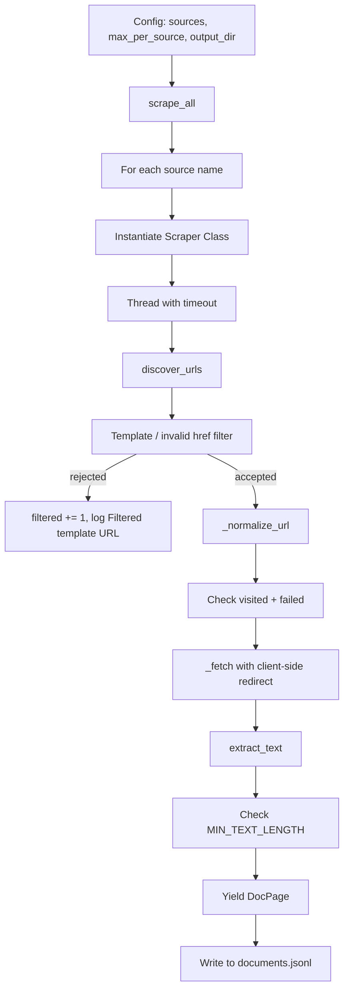

# Documentation Builder — Web Scraping System

## Overview

The documentation builder (`src/data/doc_builder.py`) is a multi-threaded web scraping framework designed to build high-quality documentation datasets for pretraining. It supports 18 distinct documentation sources across programming languages, frameworks, tools, and technical specifications. Each source is implemented as a concrete scraper class that inherits from a common abstract base, sharing infrastructure for HTTP requests, text extraction, URL normalization, and failure tracking.

## Supported Sources

All 18 scrapers are registered in the `SCRAPERS` dictionary at `src/data/doc_builder.py:694`:

| # | Key | Class | Language | Domain | Pages
|---|-----|-------|----------|--------|-------
| 1 | `python` | `PythonDocScraper` | python | backend | ~1000+
| 2 | `pytorch` | `PyTorchDocScraper` | python | ml | ~500+
| 3 | `numpy` | `NumPyDocScraper` | python | ml | ~500+
| 4 | `fastapi` | `FastAPIDocScraper` | python | backend | ~200+
| 5 | `opencv` | `OpenCVDocScraper` | cpp | cv | ~200+
| 6 | `onnx` | `ONNXDocScraper` | python | ml | ~100+
| 7 | `docker` | `DockerDocScraper` | shell | cloud | ~12* |
| 8 | `kubernetes` | `KubernetesDocScraper` | shell | cloud | ~7* |
| 9 | `postgresql` | `PostgreSQLDocScraper` | sql | backend | ~12* |
| 10 | `sqlite` | `SQLiteDocScraper` | sql | backend | ~200+
| 11 | `mdn` | `MDNDocScraper` | javascript | web | ~500+
| 12 | `rust-book` | `RustBookScraper` | rust | backend | ~200+
| 13 | `go-docs` | `GoDocScraper` | go | backend | ~200+
| 14 | `cuda` | `CUDADocScraper` | cpp | ml | ~300+ |
| 15 | `cudnn` | `CuDNNDocScraper` | cpp | ml | ~66 |
| 16 | `rfcs` | `RFCDocScraper` | text | protocols | ~9000+ |
| 17 | `linux-kernel` | `LinuxKernelDocScraper` | text | os | ~58 |
| 18 | `lang-specs` | `LangSpecScraper` | text | languages | ~18 |

*JS-rendered navigation limits static crawling (see Known Limitations). Page counts reflect the last crawl; regenerate with `python src/data/doc_builder.py` for current numbers.

## Architecture

### Class Hierarchy

```
DocScraper (ABC)
├── SphinxScraper
│   ├── PythonDocScraper
│   ├── PyTorchDocScraper
│   ├── NumPyDocScraper
│   ├── FastAPIDocScraper
│   ├── OpenCVDocScraper
│   ├── ONNXDocScraper
│   ├── DockerDocScraper
│   ├── KubernetesDocScraper
│   ├── PostgreSQLDocScraper
│   └── GoDocScraper
├── SQLiteDocScraper
├── MDNDocScraper
├── RustBookScraper
├── RFCDocScraper
├── LinuxKernelDocScraper
├── LangSpecScraper
├── CUDADocScraper
└── CuDNNDocScraper
```

### DocScraper (Abstract Base Class)

**File:** `src/data/doc_builder.py:97`

The abstract base class provides:

- **`_fetch(url, session)`** — fetches a URL with retry logic (4 attempts, no retry on 4xx except 429), a 30-second timeout, and client-side redirect following (meta refresh + `location.replace`). Returns `(html, final_url)` on success or `None`.
- **`_clean_text(html)`** — strips `<script>`, `<style>`, `<nav>`, `<footer>` tags and all remaining HTML tags, collapses whitespace.
- **`_extract_section_text(html, section_tag, fallback)`** — extracts text from a specific HTML section (e.g., `<main>`) with fallback to `<body>`.
- **`_normalize_url(url)`** — strips fragments, normalizes trailing slashes.
- **`_has_template_syntax(text)`** — rejects template placeholder URLs (`{{ }}`, ``, `${ }`, `<% %>`).
- **`_is_invalid_href(href)`** — rejects empty/`#` links, `javascript:` links, and `void(0)` links.
- **`scrape()`** — generator that yields `DocPage` objects. Tracks visited/failed URLs, enforces `MAX_PAGES`, `MIN_TEXT_LENGTH`, and `MAX_TEXT_LENGTH`. Applies the template/href filter as a final gate before `_fetch()`, counting filtered URLs.
- **`scrape_to_jsonl(output_path)`** — writes scraped pages as JSONL with fields: `source`, `language`, `category`, `title`, `url`, `text`, `text_length`.
- **`get_config()` / `SourceConfig`** — classmethod returning a `SourceConfig` dataclass with the scraper's declared settings (base URL, language, category, selectors, length limits, timeout, retry count).

### Template URL Filtering (security hardening)

All `discover_urls()` implementations reject template/invalid hrefs **before they enter the crawl queue**:

- Template placeholder URLs (`{{ }}`, ``, `${ }`, `<% %>`) are rejected at discovery (pre-yield).
- `javascript:` / `void(0)` / `#` hrefs are rejected at discovery (or by the same-domain check for non-`https://` schemes).
- Every rejected URL is logged (`Filtered template URL` at INFO) and counted in `_filtered_count`, reported as `filtered=N` in the per-source summary.
- `scrape()` re-applies `_has_template_syntax` + `_is_invalid_href` as defense-in-depth before `_fetch()`.

This guarantees template URLs such as `https://docs.docker.com/{{ meta.url | default(url) | safeUrl }}` never reach `_fetch()` and never appear as "404 fetching ..." failures.

### SphinxScraper

**File:** `src/data/doc_builder.py:197`

Extends `DocScraper` for Sphinx-generated documentation sites (Python docs, NumPy, FastAPI, OpenCV, ONNX, Docker, Kubernetes, PostgreSQL, Go). Adds:

- **`URL_PATTERNS`** — list of path patterns to add as seed URLs (e.g., `"tutorial/"`, `"library/"`).
- **`EXCLUDE_PATTERNS`** — list of patterns to exclude (e.g., `".pdf"`, `"_sources"`, `"genindex"`).
- **`CONTENT_SELECTOR`** / **`CONTENT_FALLBACK`** — HTML tag to extract content from (default `"main"` / `"body"`).
- **`discover_urls()`** — seeds from `BASE_URL` + `URL_PATTERNS`, then follows all same-domain links from seeds. Filters by `EXCLUDE_PATTERNS` and same-domain check.

## URL Discovery Strategies

Each scraper implements its own `discover_urls()` method with a strategy tailored to the source:

- **SphinxScraper** (generic): Yields `BASE_URL` + all `URL_PATTERNS` as seeds. For each seed, fetches HTML and follows all `href` links that match the base URL and are not excluded. Template/invalid hrefs are filtered before yielding. This works well for Sphinx-generated docs which have predictable link structures. Used by Docker, Kubernetes, OpenCV, ONNX, NumPy, FastAPI, Go, and Python docs.

- **PyTorchDocScraper** (`src/data/doc_builder.py:250`): Adds seed URLs (tensors.html, torch.html, nn.html, optim.html, etc.), then fetches `genindex.html` to discover additional pages via the alphabetical index. This provides broader coverage than Sphinx's auto-generated index.

- **MDNDocScraper** (`src/data/doc_builder.py:413`): Uses hardcoded `CORE_TOPICS` (HTML, CSS, JavaScript, HTTP, Web/API, Web/Guide, SVG, MathML, Web_Components, Events, Performance, Security, Accessibility) as seeds. Fetches `/en-US/docs/Web` for one-level link discovery. Filters deprecated prefixes (old SVG path APIs, GestureEvent, Microsoft-specific APIs, etc.).

- **RFCDocScraper** (`src/data/doc_builder.py:511`): Fetches the IETF text index (`https://www.ietf.org/rfc/rfc-index.txt`) which is a plain-text list of all RFC numbers. Parses each RFC number and constructs the URL `https://www.rfc-editor.org/rfc/rfc{NUMBER}.txt`. This avoids the 16MB Nuxt SSR HTML index page.

- **PostgreSQLDocScraper** (`src/data/doc_builder.py:350`): Matches links against `https://www.postgresql.org/docs/` with any version path (e.g., `/docs/16/`, `/docs/current/`) to be version-agnostic. Excludes non-HTML resources.

- **LinuxKernelDocScraper** (`src/data/doc_builder.py:540`): Full recursive discovery from `BASE_URL`. Follows all same-domain `href` links, excludes PDFs and fragment-only links.

- **SQLiteDocScraper** (`src/data/doc_builder.py:384`): Fetches `https://sqlite.org/docs.html` and follows all same-domain links, excluding `.pdf`, `.txt`, `.zip`, `.tar`.

- **LangSpecScraper** (`src/data/doc_builder.py:572`): Uses fully hardcoded URL lists — 9 Python language reference pages + 9 Rust reference pages. No link discovery needed since the language specs are a curated set.

- **CUDADocScraper** (`src/data/doc_builder.py:635`): Uses 18 hardcoded seed URLs (programming guide, runtime API, driver API, math API, best practices, cuBLAS, cuRAND, cuSOLVER, cuSPARSE, cuFFT, NVRTC, NVML, Thrust, installation guide, NVCC, release notes, PTX, C++ guide). For each seed, follows one level of `.html` links within the CUDA docs domain. **Fix applied:** the href-processing loop was previously outside the `for` loop due to an indentation bug — only the *last* href per page was processed and all earlier links were silently dropped. All links are now processed, which is why the CUDA page count increases on regeneration.

- **CuDNNDocScraper** (`src/data/doc_builder.py:667`): Uses 7 hardcoded seed URLs under `https://docs.nvidia.com/deeplearning/cudnn/latest/` (api overview, graph/ops library, developer guide, release notes, installation guide, index). Sub-link following is enabled (restricted to `.html` links within the cudnn docs domain), with a dual content selector (`article` → fallback `main`).

## Text Extraction

The text extraction pipeline has three stages:

1. **Section selection**: `_extract_section_text(html, section_tag, fallback)` uses regex to find the specified HTML tag (e.g., `<main>`, `<article>`, `<div.document>`) and extracts its inner content. Falls back to `<body>` if the primary selector is not found.

2. **Cleaning**: `_clean_text(html)` applies regex substitutions:
   - Remove `<script>...</script>` blocks
   - Remove `<style>...</style>` blocks
   - Remove `<nav>...</nav>` blocks
   - Remove `<footer>...</footer>` blocks
   - Strip all remaining HTML tags
   - Collapse whitespace

3. **Length filtering**: Documents shorter than `MIN_TEXT_LENGTH` (default 200; 5000 for RFCs, 500 for Linux kernel, 3000 for lang-specs) are discarded. Documents longer than `MAX_TEXT_LENGTH` (default 100000; 500000 for RFCs, 200000 for Linux kernel) are truncated.

> **Linux kernel threshold**: `MIN_TEXT_LENGTH` was lowered from 3000 to 500. Content extraction uses the `div.document` selector, which excludes the navigation sidebar (`div.sphinxsidebar`), so navigation/index pages yield under 500 chars and are still filtered. Verification on the server re-run confirmed the new pages are legitimate content.

Content selectors vary per scraper:

| Scraper | Primary Selector | Fallback |
|---------|-----------------|----------|
| SphinxScraper (most) | `main` | `body` |
| MDNDocScraper | `article` | `main` |
| SQLiteDocScraper | `body` | none |
| LinuxKernelDocScraper | `div.document` | `body` |
| RFCDocScraper | (plain text, no HTML cleaning) | |

## Failure Handling

- **`_failed` set**: Each scraper instance maintains a set of failed URLs. Once a URL fails (404, timeout, connection error), it is never re-fetched within the same scrape session.
- **`_filtered_count`**: Template/invalid URLs rejected at discovery or at the `scrape()` gate are counted separately — they are never treated as failed requests.
- **Per-scraper summary stats**: After scraping, `_summary()` reports discovered count, duplicate count, filtered count, and failed count.
- **Per-source timeout**: The `scrape_all()` function (`src/data/doc_builder.py:716`) runs each scraper in a separate thread with a configurable timeout (default 600 seconds). If a scraper exceeds the timeout, the thread is abandoned and the source is reported as timed out.
- **MAX_PAGES enforcement**: The `scrape()` generator checks `count >= self.MAX_PAGES` at each yield point, so over-discovery does not lead to unbounded scraping.
- **Client-side redirect following**: `_find_client_redirect()` handles `<meta http-equiv="refresh">` redirects and `location.replace()`/`location.href` JavaScript redirects, following up to 4 redirect hops.

## Known Limitations

1. **Cloudflare-challenged sites**: PyTorch docs are behind Cloudflare's anti-bot challenge. The scraper may return 0 pages despite the genindex discovery strategy. Possible fixes: use `readthedocs.io` mirror or integrate `cloudscraper`.
2. **JS-rendered content**: MDN and RFC sites use JavaScript frameworks (MDN uses SPA routing, RFC uses Nuxt SSR). Content may be missing or degraded without a headless browser.
3. **Rate limiting**: Aggressive scraping may trigger rate limiting on some sites (Docker, Kubernetes, NVIDIA docs). The built-in retry with backoff mitigates this partially.
4. **16MB RFC index page**: The original HTML RFC index was a 16MB Nuxt SSR page that often timed out. This was fixed by switching to the IETF text index (`rfc-index.txt`).
5. **PostgreSQL docs navigation change**: The PostgreSQL docs site now uses Bootstrap with JS-rendered navigation. The URL validation fix (`startswith("https://www.postgresql.org/docs/")`) accepts all version paths; page counts after the fix are expected to increase on the next server run.
6. **cuDNN seed URLs**: Seeds were updated to the `/latest/` structure. If any seeds 404 permanently after the next run, remove the obsolete entries — do not retry permanently dead pages.
7. **Docker/Kubernetes JS-heavy navigation**: Docusaurus/Hugo sites render deep navigation client-side; coverage is limited to static-HTML links (Docker ~12, Kubernetes ~7 pages). Documented as a known limitation — no headless-browser integration.
8. **OpenCV Doxygen cross-references**: Cross-reference pages generated by Doxygen resolve to targets the static crawler cannot follow; residual failures are expected and non-blocking.

## Scraping Flow



## Registry Integration

After scraping, `build_doc_registry()` (`src/data/doc_builder.py:757`) creates `DatasetInfo` entries for each scraped source. These entries:
- Use `path="json"` and `data_dir` pointing to the JSONL output directory
- Get proportional weights based on the `weights` dict (default: python 0.18, pytorch 0.13, mdn 0.15, rust-book 0.10, etc.)
- Have `quality_score=0.95` and `category="docs"`
- Are registered into the main dataset registry via `build_registry()` in `registry.py`

## Usage

```bash
# Scrape all 18 sources with default settings
python src/data/doc_builder.py

# Scrape specific sources only
python src/data/doc_builder.py --sources python numpy fastapi

# Limit pages per source
python src/data/doc_builder.py --max-per-source 500

# Specify output directory
python src/data/doc_builder.py --output-dir data/my_docs
```

The `scrape_all()` function is also called programmatically from `production_validation.py` Phase 2.
