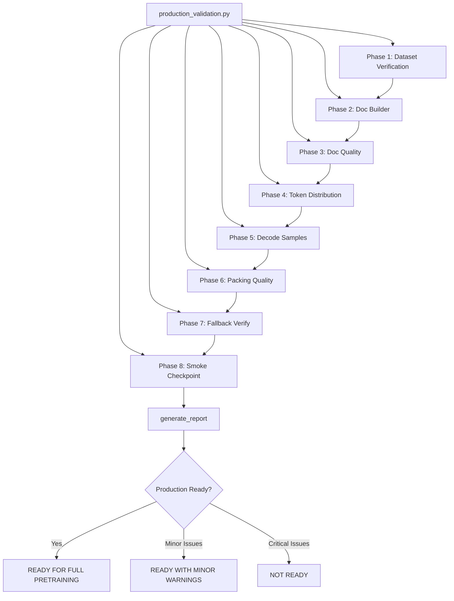

# Production Validation System

## Corpus Quality Audit (`scripts/corpus_audit.py`)

Standalone quality gate for generated JSONL corpora, run before the full production validation:

```bash
python scripts/corpus_audit.py
```

Audits every `documents.jsonl` under `data/docs`, `data/web_text`, `data/math`, `data/science`, and `data/books`. For each file it verifies:

- UTF-8 validity and JSON parseability of every line
- Empty documents, duplicate ratio (exact-text), HTML leakage (`<html`, `<!doctype`, `<div`, `<p>`)
- Min / average / median / max document length and estimated token count (chars ÷ 4)

**Status codes**: `PASS`, `PASS_WARN`, `CORRUPT` (unreadable, no valid records, >5% parse errors), `HTML_LEAKAGE` (>1%), `HIGH_DUP` (>50%), `MISSING`.

Exit code 1 if any dataset is not `PASS`/`PASS_WARN`. Corrupt artifacts (e.g., a 0-byte `documents.jsonl` from an interrupted run) are removed so the source is re-crawled on regeneration.

---

## Overview

The production validation system (`scripts/production_validation.py`) is a suite of 8 sequential phases that validate every component of the training pipeline before full-scale pretraining. Each phase tests a specific aspect of the data or training pipeline and reports detailed metrics. A final report generator determines production readiness.

## Execution

```bash
# Run all 8 phases
python scripts/production_validation.py

# Skip doc building and smoke test
python scripts/production_validation.py --skip-docs --skip-smoke

# Customize
python scripts/production_validation.py \
    --token hf_xxxx \
    --doc-dir data/docs \
    --tokenizer Xenova/claude-tokenizer \
    --max-samples 5000 \
    --smoke-steps 100 \
    --report reports/validation_report.txt
```

Report output: plain-text summary printed to stdout and optionally saved to a file (with companion `.json` file containing raw phase data).

---

## Phase 1: Dataset Verification

**Function**: `phase1_verify_registry()`

Tests that all 55 registry entries can be loaded from HuggingFace. For each entry:
1. Attempts to load 5 samples via `stream_dataset_with_fallbacks()`
2. Reports status: `ok` (loaded successfully), `failed` (load error), `gated` (authentication required), `skipped_dup` (duplicate entry), or `local_json` (JSONL file)
3. Calculates `available_pct` = total weight of available entries / total weight

**Reports**:
- Total entries and total weight
- Available weight and percentage
- List of failures with path, category, weight, and error message

**Expected**: >90% available weight. Known failures: GAIR/MathPile (gated), some doc sources if JSONL not yet built.

---

## Phase 2: Documentation Builder

**Function**: `phase2_build_docs()`

Runs the doc builder if docs have not been built yet.

- **Default**: `--max-per-source 2000`, all 18 sources
- Skips sources whose JSONL files already exist
- Enforces per-source timeout (default 600 seconds per thread)

**Reports**:
- Total pages scraped across all sources
- Missing JSONL files (source not scraped)
- Empty JSONL files (source scraped but 0 pages)

**Expected**: 2000 pages per source where available. Known limitations: PyTorch (Cloudflare), PostgreSQL (nav redesign), Docker/Kubernetes (9-12 pages only).

---

## Phase 3: Documentation Quality

**Function**: `phase3_validate_docs()`

Analyzes the quality of scraped documentation. For each source:

- **Average document length**: Total characters / document count
- **Duplicate percentage**: `(1 - unique_urls / total_urls) * 100`
- **Short document percentage**: Documents with `< 200` characters
- **Length distribution**: Per-source total character counts
- **Metadata presence**: Checks `source`, `title`, and `text` fields exist in first 100 documents

**Reports**:
- Per-source quality metrics
- Total documents and total characters aggregated

**Expected**: Low duplicate percentage (<5%), low short document percentage (<10%), all metadata present.

---

## Phase 4: Token Distribution

**Function**: `phase4_token_distribution()`

Measures the actual token distribution across categories and compares it to targets.

1. Loads the tokenizer (`Xenova/claude-tokenizer` by default)
2. Builds the pretrain dataset via `DataPipeline` with `config_foundation.yaml`
3. Samples up to `max_samples` (default 5000) sequences
4. For each sequence, reads `_category` metadata and sums `attention_mask` for token count
5. Compares per-category percentages to targets:
   - code: 30%, web_text: 20%, docs: 15%, wiki: 10%, math: 10%, science: 5%, books: 5%, structured_knowledge: 5%
6. Marks each category as OK (diff < 3%), HIGH (diff > target), or LOW (diff < target)

**Reports**:
- Per-category: tokens, percentage, target, diff, status
- Overall status: OK or WARNING

**Expected**: All categories within ±3% of targets. Warnings indicate weight mismatch that needs correction.

---

## Phase 5: Decoded Sample Inspection

**Function**: `phase5_decode_samples()`

Decodes 20 random tokenized samples and inspects them for quality issues.

1. Builds the pretrain dataset
2. For each sample, decodes `input_ids` to text (with EOS markers visible)
3. Checks for:
   - **EMPTY**: No text after decoding
   - **MALFORMED_UTF8**: More than 10 U+FFFD replacement characters
   - **LICENSE_SPAM**: License boilerplate in short text (<200 chars)
   - **EXCESSIVE_NEWLINES**: More than 5 occurrences of 4+ consecutive newlines
   - **REPETITIVE**: Fewer than 20 unique characters
   - **NO_DATASET_META**: Missing `_dataset` field
   - **ZERO_SEGMENTS**: Packed sequence with 0 segments
   - **SEG_MISMATCH**: EOS token count doesn't match segment count
   - **DIRTY_PADDING**: Padding region contains non-trivial content

**Reports**:
- Per-sample: category, dataset, segments, avg quality, token length, issues
- Aggregate: metadata ok count, metadata missing count, total issues

**Expected**: Zero issues. Any issues indicate data quality problems that must be fixed before training.

---

## Phase 6: Packing Quality

**Function**: `phase6_packing_quality()`

Analyzes the quality of sequence packing across up to 2000 samples.

- **Padding distribution**: Buckets by padding amount (0-1, 2-5, 6-16, 17-64, 65+)
- **Average quality score** in packed sequences (`_avg_quality` field)
- **UTF-8 corruption**: Samples with more than 20 U+FFFD characters
- **Zero-segment detection**: Samples where `_segments < 1`
- **Missing metadata**: Samples missing `_dataset` or `_category`

**Metrics**:
- Max sequence length
- Average actual length
- Average padding (absolute and percentage)
- Average utilization percentage
- Average segments per packed sequence
- Average quality score

**Status**: PASS if padding < 5%, no corrupted UTF-8, no missing metadata. WARNING otherwise.

**Expected**: PASS with padding < 5%.

---

## Phase 7: Fallback Verification

**Function**: `phase7_verify_fallbacks()`

Tests that the fallback chain works correctly for documentation sources.

1. Finds a docs entry (e.g., `python-docs`) in the registry
2. Attempts to load 1 sample via `stream_dataset_with_fallbacks()`
3. If the primary JSONL source is missing (docs not yet built), verifies that FineWeb-Edu fallback is activated
4. Reports fallback activated status and sample count

**Reports**:
- `docs_fallback`: status (ok/empty/error), fallback_activated, samples

**Expected**: Fallback activates correctly. Docs → FineWeb-Edu chain resolves.

---

## Phase 8: Checkpoint Smoke Test

**Function**: `phase8_smoke_checkpoint()`

Tests the training loop and checkpoint save/load/resume cycle.

**Step 1 — Train**:
1. Runs `scripts/run_training.py` with `config_foundation.yaml` for `max_steps` (default 100)
2. Uses a temporary directory for checkpoints
3. Logging steps = 1 for detailed output

**Step 2 — Verify checkpoint**:
1. Scans the output directory for `.pt` files or `checkpoint-*` directories
2. Reports the first checkpoint file found

**Step 3 — Resume**:
1. If checkpoint exists and training step returned 0:
2. Runs `scripts/run_training.py` with `--resume-from` pointing to the checkpoint directory
3. Sets `--max-steps` to `max_steps + 10` to verify 10 more steps execute

**Reports**:
- Train return code
- Checkpoint found (bool), checkpoint files list
- Resume return code
- Status: PASS/WARNING

**Expected**: PASS — all return codes 0, checkpoint found, resume succeeds.

---

## Report Generator

**Function**: `generate_report()`

Assembles all phase results into a production readiness report.

**Decision logic**:
- **READY FOR FULL PRETRAINING**: No issues detected (all phases pass)
- **READY WITH MINOR WARNINGS**: Only non-critical issues (e.g., padding slightly above target, minor distribution deviation)
- **NOT READY**: Critical issues present (corpus availability < 90%, padding >= 5%, token distribution off by > 3%, decoded sample issues, training/failback failures)

**Issue categories**:
1. Corpus availability < 90% → NOT READY
2. Padding >= 5% → NOT READY
3. Token distribution deviation > 3% → WARNING
4. Decoded sample issues → NOT READY
5. Training smoke test failed → NOT READY
6. Checkpoint save failed → NOT READY
7. Checkpoint resume failed → NOT READY
8. Fallback errors → NOT READY

---

## Mermaid Diagram


